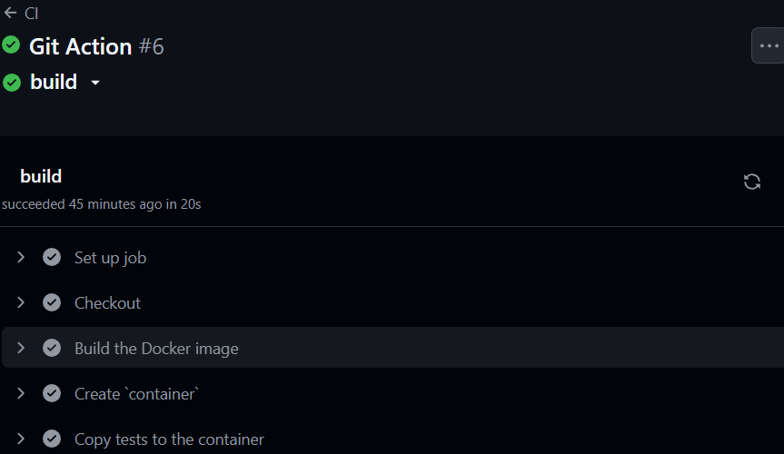

# Lucrarea de laborator numarul 8
### <i>Tema:</i> Integrare continuă cu Github Actions
### <i>Data:</i>20.04.2025 

Integrare continuă cu Github Actions

### Scopul lucrării:

Configurarea integrării continue a unui proiect prin intermediul la GitHub Actions.

### Sarcina:

Crearea unei aplicații Web, scrierea testelor pentru aceasta și configurarea integrării continue cu ajutorul Github Actions pe baza containerelor.

### Efectuarea lucrării:

1) Am creat directorul containers08, în care am creat directorul site.
2) În folderul site am creat fișierul „modules/database.php„, în care am creat clasa Database cu parametrul connection.
- În clasă am creat un constructor:
```php
 public function __construct($path) {
        try {
            $this->connection = new \PDO("sqlite:$path");
            $this->connection->setAttribute(\PDO::ATTR_ERRMODE, \PDO::ERRMODE_EXCEPTION);
        } catch (\PDOException $e) {
            die("Database connection error: " . $e->getMessage());
        }
    }
```
- Funcția Execute:
```php
public function Execute($sql) {
        try {
            return $this->connection->exec($sql);
        } catch (\PDOException $e) {
            die("SQL execution error: " . $e->getMessage());
        }
    }
```
- Funcția Fetch:
```php
public function Fetch($sql) {
        try {
            $statement = $this->connection->query($sql);
            return $statement->fetchAll(\PDO::FETCH_ASSOC);
        } catch (\PDOException $e) {
            die("SQL fetch error: " . $e->getMessage());
        }
    }
```
- Funcția Create:
```php
public function Create($table, $data) {
        try {
            $columns = implode(", ", array_keys($data));
            $placeholders = implode(", ", array_fill(0, count($data), "?"));
            
            $sql = "INSERT INTO $table ($columns) VALUES ($placeholders)";
            $statement = $this->connection->prepare($sql);
            $statement->execute(array_values($data));
            
            return $this->connection->lastInsertId();
        } catch (\PDOException $e) {
            die("Create record error: " . $e->getMessage());
        }
    }
```
- Funcția Read:
```php
public function Read($table, $id) {
        try {
            $sql = "SELECT * FROM $table WHERE id = ?";
            $statement = $this->connection->prepare($sql);
            $statement->execute([$id]);
            
            return $statement->fetch(\PDO::FETCH_ASSOC);
        } catch (\PDOException $e) {
            die("Read record error: " . $e->getMessage());
        }
    }
```
- Funcția Update:
```php
public function Update($table, $id, $data) {
        try {
            $setParts = [];
            foreach (array_keys($data) as $column) {
                $setParts[] = "$column = ?";
            }
            $setClause = implode(", ", $setParts);
            
            $sql = "UPDATE $table SET $setClause WHERE id = ?";
            $statement = $this->connection->prepare($sql);
            
            $values = array_values($data);
            $values[] = $id;
            
            return $statement->execute($values);
        } catch (\PDOException $e) {
            die("Update record error: " . $e->getMessage());
        }
    }
```
- Funcția Delete:
```php
public function Delete($table, $id) {
        try {
            $sql = "DELETE FROM $table WHERE id = ?";
            $statement = $this->connection->prepare($sql);
            
            return $statement->execute([$id]);
        } catch (\PDOException $e) {
            die("Delete record error: " . $e->getMessage());
        }
    }
```
- Funcția Count:
```php
public function Count($table) {
        try {
            $sql = "SELECT COUNT(*) as count FROM $table";
            $statement = $this->connection->query($sql);
            $result = $statement->fetch(\PDO::FETCH_ASSOC);
            
            return (int)$result['count'];
        } catch (\PDOException $e) {
            die("Count records error: " . $e->getMessage());
        }
    }
```
3) În folderul modules am creat fișierul `page.php` care deține următoarea clasă:
```php
class Page {
    private $template;
    
    public function __construct($template) {
        if (!file_exists($template)) {
            die("Template file not found: $template");
        }
        
        $this->template = $template;
    }
    
    public function Render($data) {
        // Read the template content
        $content = file_get_contents($this->template);
        
        if ($content === false) {
            die("Failed to read template file: {$this->template}");
        }
        
        // Replace placeholders with data
        foreach ($data as $key => $value) {
            $placeholder = "{{" . $key . "}}";
            $content = str_replace($placeholder, $value, $content);
        }
        
        // Output the rendered content
        echo $content;
    }
}
```
4) În directorul site am creat fișierul `templates/index.tpl` cu următorul șablon:
```tpl
<!DOCTYPE html>
<html lang="en">
<head>
    <meta charset="UTF-8">
    <meta name="viewport" content="width=device-width, initial-scale=1.0">
    <title>{{title}}</title>
    <link rel="stylesheet" href="styles/style.css">
</head>
<body>
    <div class="container">
        <header>
            <h1>{{header}}</h1>
            <nav>
                <ul>
                    {{navigation}}
                </ul>
            </nav>
        </header>
        
        <main>
            <div class="content">
                {{content}}
            </div>
            <div class="sidebar">
                {{sidebar}}
            </div>
        </main>
        
        <footer>
            <p>{{footer}}</p>
        </footer>
    </div>
</body>
</html>
```
5) În folderul site am creat fișierul `styles/style.css` cu următorul conținut:
```css
body {
    font-family: Arial, sans-serif;
    line-height: 1.6;
    margin: 0;
    padding: 20px;
    color: #333;
}

h1 {
    color: #444;
    border-bottom: 1px solid #eee;
    padding-bottom: 10px;
}

.content {
    margin-top: 20px;
}
```
6) În folderul site am creat fișierul `index.php` cu următorul conținut:
```php
<?php

require_once __DIR__ . '/modules/database.php';
require_once __DIR__ . '/modules/page.php';

require_once __DIR__ . '/config.php';

$db = new Database($config["db"]["path"]);

$page = new Page(__DIR__ . '/templates/index.tpl');

$pageId = isset($_GET['page']) ? (int)$_GET['page'] : 1;

if ($pageId < 1) {
    $pageId = 1;
}

$data = $db->Read("page", $pageId);

if (!$data) {
    $data = [
        'title' => 'Pagină negăsită',
        'content' => '<p>Pagina solicitată nu există.</p>'
    ];
}

echo $page->Render($data);
```
7) În directorul site am creat folderul `tests` în care am adăugat fișierul `testframework.php` cu următorul conținut:
```php
<?php

function message($type, $message) {
    $time = date('Y-m-d H:i:s');
    echo "{$time} [{$type}] {$message}" . PHP_EOL;
}

function info($message) {
    message('INFO', $message);
}

function error($message) {
    message('ERROR', $message);
}

function assertExpression($expression, $pass = 'Pass', $fail = 'Fail'): bool {
    if ($expression) {
        info($pass);
        return true;
    }
    error($fail);
    return false;
}

class TestFramework {
    private $tests = [];
    private $success = 0;

    public function add($name, $test) {
        $this->tests[$name] = $test;
    }

    public function run() {
        foreach ($this->tests as $name => $test) {
            info("Running test {$name}");
            if ($test()) {
                $this->success++;
            }
            info("End test {$name}");
        }
    }

    public function getResult() {
        return "{$this->success} / " . count($this->tests);
    }
}
```
8) În directorul `tests` am creat fișierul `tests.php` cu următorul conținut, pentru testarea metodelor claselor Database și Page:
```php
<?php

require_once __DIR__ . '/testframework.php';

require_once __DIR__ . '/../config.php';
require_once __DIR__ . '/../modules/database.php';
require_once __DIR__ . '/../modules/page.php';

$tests = new TestFramework();

function testDbConnection() {
    global $config;

    try {
        $db = new \modules\Database($config["db"]["path"]);
        return true;
    } catch (Exception $e) {
        return false;
    }
}

function testDbCount() {
    global $config;

    $db = new \modules\Database($config["db"]["path"]);
    $count = $db->Count("page");

    return is_int($count) && $count >= 0;
}

function testDbCreate() {
    global $config;

    $db = new \modules\Database($config["db"]["path"]);

    $data = [
        'title' => 'Test Page',
        'content' => '<p>This is a test page content.</p>'
    ];

    $id = $db->Create("page", $data);

    return is_numeric($id) && $id > 0;
}

function testDbRead() {
    global $config;

    $db = new \modules\Database($config["db"]["path"]);

    $data = [
        'title' => 'Test Page',
        'content' => '<p>This is a test page content.</p>'
    ];

    $id = $db->Create("page", $data);

    $result = $db->Read("page", $id);

    return is_array($result) && $result['title'] === 'Test Page';
}

function testDbUpdate() {
    global $config;

    $db = new \modules\Database($config["db"]["path"]);

    $data = [
        'title' => 'Test Page',
        'content' => '<p>This is a test page content.</p>'
    ];

    $id = $db->Create("page", $data);

    $updateData = [
        'title' => 'Updated Title',
        'content' => '<p>Updated content.</p>'
    ];

    $db->Update("page", $id, $updateData);

    $result = $db->Read("page", $id);

    return $result['title'] === 'Updated Title' && $result['content'] === '<p>Updated content.</p>';
}

function testDbDelete() {
    global $config;

    $db = new \modules\Database($config["db"]["path"]);

    $data = [
        'title' => 'Test Page',
        'content' => '<p>This is a test page content.</p>'
    ];

    $id = $db->Create("page", $data);

    $result = $db->Delete("page", $id);

    $readResult = $db->Read("page", $id);

    return $result === true && empty($readResult);
}

function testDbExecute() {
    global $config;

    $db = new \modules\Database($config["db"]["path"]);

    $result = $db->Execute("UPDATE page SET title = 'Great title' WHERE id = 1");

    return $result !== false;
}

function testDbFetch() {
    global $config;

    $db = new \modules\Database($config["db"]["path"]);

    $result = $db->Fetch("SELECT * FROM page LIMIT 1");

    return is_array($result) && count($result) > 0;
}

function testPageConstructor() {
    try {
        $page = new \modules\Page(__DIR__ . '/../templates/index.tpl');
        return true;
    } catch (Exception $e) {
        return false;
    }
}

function testPageRender() {
    $page = new \modules\Page(__DIR__ . '/../templates/index.tpl');

    $data = [
        'title' => 'Test Page',
        'header' => 'Test Header',
        'content' => '<p>This is a test page content.</p>',
        'navigation' => '<li><a href="#">Home</a></li>',
        'sidebar' => '<p>Sidebar content</p>',
        'footer' => '&copy; 2025 Test'
    ];

    ob_start();
    $page->Render($data);
    $rendered = ob_get_clean();

    return strpos($rendered, 'Test Page') !== false &&
           strpos($rendered, 'This is a test page content.') !== false;
}

function testPageRenderInvalidData() {
    $page = new \modules\Page(__DIR__ . '/../templates/index.tpl');

    $data = "This is not an array";

    try {
        $page->Render($data);
        return false;
    } catch (Exception $e) {
        return true;
    }
}

$tests->add('Database connection', 'testDbConnection');
$tests->add('Database count method', 'testDbCount');
$tests->add('Database create method', 'testDbCreate');
$tests->add('Database read method', 'testDbRead');
$tests->add('Database update method', 'testDbUpdate');
$tests->add('Database delete method', 'testDbDelete');
$tests->add('Database execute method', 'testDbExecute');
$tests->add('Database fetch method', 'testDbFetch');
$tests->add('Page constructor', 'testPageConstructor');
$tests->add('Page render method', 'testPageRender');
$tests->add('Page render with invalid data', 'testPageRenderInvalidData');

$tests->run();

echo $tests->getResult();

?>
```
9) În directorul rădăcină am creat fișierul `Dockerfile` cu următorul conținut:
```php
FROM php:7.4-fpm as base

RUN apt-get update && \
    apt-get install -y sqlite3 libsqlite3-dev && \
    docker-php-ext-install pdo_sqlite

VOLUME ["/var/www/db"]

COPY site/sql/schema.sql /var/www/db/schema.sql

RUN echo "prepare database" && \
    cat /var/www/db/schema.sql | sqlite3 /var/www/db/db.sqlite && \
    chmod 777 /var/www/db/db.sqlite && \
    rm -rf /var/www/db/schema.sql && \
    echo "database is ready"

COPY site /var/www/html/site
```
10) În directorul rădăcină am creat fișierul `.github/workflows/main.yml` cu următorul conținut:
```yml
name: CI

on:
  push:
    branches:
      - main

jobs:
  build:
    runs-on: ubuntu-latest
    steps:
      - name: Checkout
        uses: actions/checkout@v4
      - name: Build the Docker image
        run: docker build -t containers08 .
      - name: Create `container`
        run: docker create --name container --volume database:/var/www/db containers08
      - name: Copy tests to the container
        run: docker cp ./tests container:/var/www/html/tests
      - name: Up the container
        run: docker start container
      - name: Run tests
        run: docker exec container php /var/www/html/tests/tests.php
      - name: Stop the container
        run: docker stop container
      - name: Remove the container
        run: docker rm container
```
11) Am creat repozitoriu pe GitHub în care am încărcat proiectul și am văzut că proiectul a trecut procesul de build:


### Întrebări:

1) Ce este integrarea continuă?
   
Integrarea continuă reprezintă practica de a salva și testa automat codul unui proiect într-un mod frecvent.

2) Pentru ce sunt necesare testele unitare? Cât de des trebuie să fie executate?

Testele unitare sunt necesare în dezvoltarea software, deoarece verifică dacă fiecare unitate (clasă, metodă, funcție) a codului funcționează corect izolat. Ele ar trebui să fie executate la fiecare modificare a esențială a codului (atunci când se face commit la proiect).

3) Care modificări trebuie făcute în fișierul .github/workflows/main.yml pentru a rula testele la fiecare solicitare de trage (Pull Request)?

În secțiunea on ar trebui de adăugat pull_request: branches: - main

4) Ce trebuie adăugat în fișierul .github/workflows/main.yml pentru a șterge imaginile create după testare?

Ar trebui de adăugat un nou step de run: docker rmi containers08

### Concluzie:

În acest laborator am învățat despre conceptul de integrare continuă într-un proiect. Am învățat cum să scriu un fișier pentru procesarea automată a integrării cuntinue pentru procesul de build. De asemenea, am văzut cum să utilizez GitHub Actions pentru procesul CI al unui proiect.